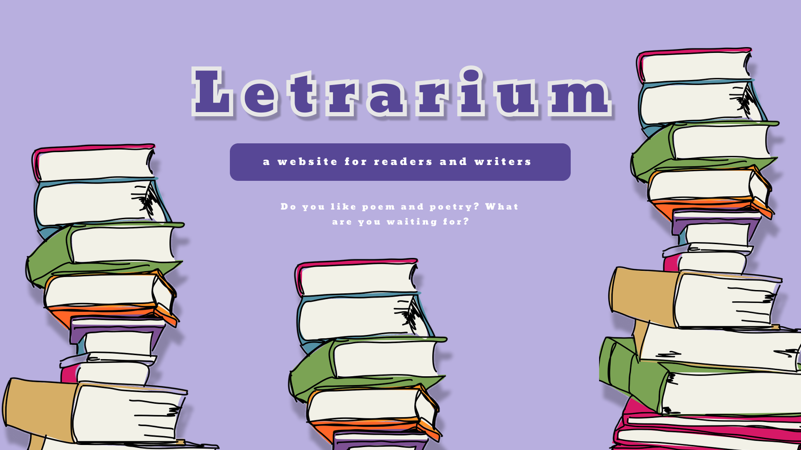

<h1 align="center"> Letrarium </h1>

Bem-vindo ao Letrarium! Uma rede social criada especialmente para escritores e leitores apaixonados por poesia! Este projeto tem como objetivo conectar pessoas que compartilham o amor pela arte das palavras, oferecendo um espaço interativo para criar, compartilhar e descobrir poemas.

  

## 🛠️ Construído com

Lista das principais tecnologias e ferramentas utilizadas para desenvolver o projeto:

- **HTML5**: Estruturação das páginas.
- **CSS3**: Estilização e design responsivo.
- **JavaScript**: Funcionalidades interativas no site.
- **PHP**: Lógica do servidor e integração com o banco de dados.
- **MySQL**: Banco de dados para armazenar informações como usuários, poemas, categorias e tags.

Combinando essas tecnologias, o projeto oferece uma experiência fluida para escritores e leitores de poesia. 🌟

##

Feito com ♥ by Letrarium 
